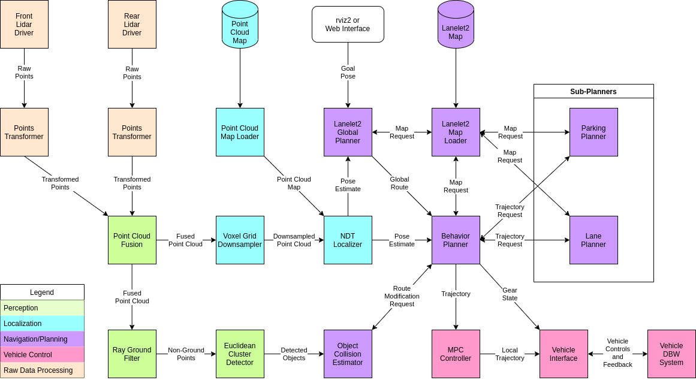
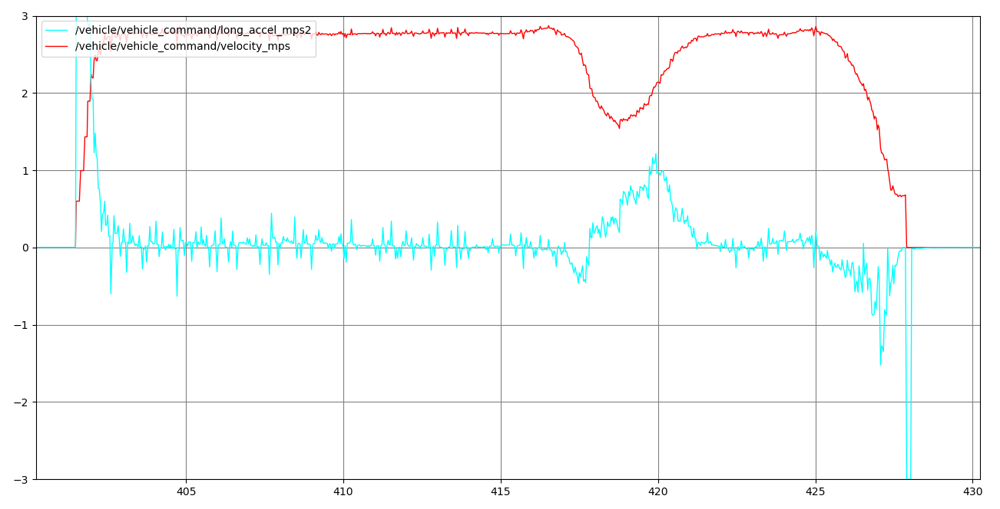

# MELEX_AUTOWARE_AUTO_AVP_DEMO

## Description
### Messages design for vehicle interface

Publishers:
*  /vehicle/odom_pose: geometry_msgs/msg/PoseWithCovarianceStamped
    <details>
    <summary>Interface</summary>
    
    ```
    std_msgs/Header header
    PoseWithCovariance pose
    ```
    </details>   

   <details>
   <summary>Example output</summary>
   
   ```
   ---
   header:
     stamp:
       sec: 1627383589
       nanosec: 86323456
     frame_id: odom
   pose:
     pose:
       position:
         x: 30.273908615112305
         y: 90.37340927124023
         z: 0.5375595092773438
       orientation:
         x: -0.004414775874465704
         y: 0.002566313836723566
         z: 0.3381696045398712
         w: 0.9410713315010071
     covariance:
     - 0.1
     - 0.0
     - 0.0
     - 0.0
     - 0.0
     - 0.0
     - 0.0
     - 0.1
     - 0.0
     - 0.0
     - 0.0
     - 0.0
     - 0.0
     - 0.0
     - 0.1
     - 0.0
     - 0.0
     - 0.0
     - 0.0
     - 0.0
     - 0.0
     - 0.1
     - 0.0
     - 0.0
     - 0.0
     - 0.0
     - 0.0
     - 0.0
     - 0.1
     - 0.0
     - 0.0
     - 0.0
     - 0.0
     - 0.0
     - 0.0
     - 0.1
   ---
   ```

    </details>

*   /vehicle/odometry: autoware_auto_msgs/msg/VehicleOdometry
    <details>
    <summary>Interface</summary>
    
    ```
    #include "builtin_interfaces/msg/Time.idl"
    
    module autoware_auto_msgs {
      module msg {
        @verbatim (language="comment", text=
          " VehicleOdometry.msg")
        struct VehicleOdometry {
          builtin_interfaces::msg::Time stamp;
    
          @default (value=0.0)
          float velocity_mps;
    
          @default (value=0.0)
          float front_wheel_angle_rad;
    
          @default (value=0.0)
          float rear_wheel_angle_rad;
        };
      };
    };
    ```
    </details>   
    <details>
    <summary>Example output</summary>
   
    ```
    ---
    stamp:
      sec: 1627383542
      nanosec: 336368128
    velocity_mps: 0.49711716175079346
    front_wheel_angle_rad: 0.050000011920928955
    rear_wheel_angle_rad: 0.0
    ---
    ```

   </details>
   
*   **/vehicle/state_report: autoware_auto_msgs/msg/VehicleStateReport**
    
    <details>
    <summary>Interface</summary>
    
    ```
    #include "builtin_interfaces/msg/Time.idl"

    module autoware_auto_msgs {
      module msg {
        module VehicleStateReport_Constants {
          const uint8 BLINKER_OFF = 1;
          const uint8 BLINKER_LEFT = 2;
          const uint8 BLINKER_RIGHT = 3;
          const uint8 BLINKER_HAZARD = 4;
          const uint8 HEADLIGHT_OFF = 1;
          const uint8 HEADLIGHT_ON = 2;
          const uint8 HEADLIGHT_HIGH = 3;
          const uint8 WIPER_OFF = 1;
          const uint8 WIPER_LOW = 2;
          const uint8 WIPER_HIGH = 3;
          const uint8 WIPER_CLEAN = 14; // Match WipersCommand::ENABLE_CLEAN
          const uint8 GEAR_DRIVE = 1;
          const uint8 GEAR_REVERSE = 2;
          const uint8 GEAR_PARK = 3;
          const uint8 GEAR_LOW = 4;
          const uint8 GEAR_NEUTRAL = 5;
          const uint8 MODE_AUTONOMOUS = 1;
          const uint8 MODE_MANUAL = 2;
          const uint8 MODE_DISENGAGED = 3;
          const uint8 MODE_NOT_READY = 4;
        };
    
        struct VehicleStateReport {
          builtin_interfaces::msg::Time stamp;
    
          @verbatim (language="comment", text=
            " 0 to 100")
          uint8 fuel;
    
          uint8 blinker;
    
          uint8 headlight;
    
          uint8 wiper;
    
          uint8 gear;
    
          uint8 mode;
    
          boolean hand_brake;
    
          boolean horn;
        };
      };
    };
    ```
    </details>
    <details>
    <summary>Example output</summary>
   
    ```
    ---
    stamp:
      sec: 0
      nanosec: 0
    fuel: 0
    blinker: 2
    headlight: 1
    wiper: 1
    gear: 1
    mode: 0
    hand_brake: false
    horn: false
    ---
    ```
    </details>  

*  **/vehicle/vehicle_kinematic_state: autoware_auto_msgs/msg/VehicleKinematicState**
    <details>
    <summary>Interface</summary>
    
    ```
    #include "autoware_auto_msgs/msg/TrajectoryPoint.idl"
    #include "geometry_msgs/msg/Transform.idl"
    #include "std_msgs/msg/Header.idl"
    
    module autoware_auto_msgs {
      module msg {
        @verbatim (language="comment", text=
          " VehicleKinematicState.msg" "\n"
          " Representation of a trajectory point with timestamp for the controller")
        struct VehicleKinematicState {
          std_msgs::msg::Header header;
    
          autoware_auto_msgs::msg::TrajectoryPoint state;
    
          geometry_msgs::msg::Transform delta;
        };
      };
    };
    ```
    </details>
    <details>
    <summary>Example output</summary>
   Example acquired during driving. lateral_velocity_mps and acceleration_mps2 always equal 0.
   
   ```
   ---
   header:
     stamp:
       sec: 1627304034
       nanosec: 547711744
     frame_id: odom
   state:
     time_from_start:
       sec: 0
       nanosec: 0
     x: 46.602638244628906
     y: 44.43940734863281
     heading:
       real: 0.9631139039993286
       imag: 0.2690940499305725
     longitudinal_velocity_mps: 7.514681339263916
     lateral_velocity_mps: 0.0
     acceleration_mps2: 0.0
     heading_rate_rps: -0.004081131890416145
     front_wheel_angle_rad: 0.0
     rear_wheel_angle_rad: 0.0
   delta:
     translation:
       x: 0.0
       y: 0.0
       z: 0.0
     rotation:
       x: 0.0
       y: 0.0
       z: 0.0
       w: 1.0
   ---
   ```
    </details>  
Subscribers:
*  **/vehicle/state_command: autoware_auto_msgs/msg/VehicleStateCommand**
    <details>
    <summary>Interface</summary>
    
    ```
   #include "builtin_interfaces/msg/Time.idl"

   module autoware_auto_msgs {
     module msg {
       module VehicleStateCommand_Constants {
         const uint8 BLINKER_NO_COMMAND = 0;
         const uint8 BLINKER_OFF = 1;
         const uint8 BLINKER_LEFT = 2;
         const uint8 BLINKER_RIGHT = 3;
         const uint8 BLINKER_HAZARD = 4;
         const uint8 HEADLIGHT_NO_COMMAND = 0;
         const uint8 HEADLIGHT_OFF = 1;
         const uint8 HEADLIGHT_ON = 2;
         const uint8 HEADLIGHT_HIGH = 3;
         const uint8 WIPER_NO_COMMAND = 0;
         const uint8 WIPER_OFF = 1;
         const uint8 WIPER_LOW = 2;
         const uint8 WIPER_HIGH = 3;
         const uint8 WIPER_CLEAN = 14; // Match WipersCommand::ENABLE_CLEAN
         const uint8 GEAR_NO_COMMAND = 0;
         const uint8 GEAR_DRIVE = 1;
         const uint8 GEAR_REVERSE = 2;
         const uint8 GEAR_PARK = 3;
         const uint8 GEAR_LOW = 4;
         const uint8 GEAR_NEUTRAL = 5;
         const uint8 MODE_NO_COMMAND = 0;
         const uint8 MODE_AUTONOMOUS = 1;
         const uint8 MODE_MANUAL = 2;
       };
       @verbatim (language="comment", text=
         " VehicleStateCommand.msg")
       struct VehicleStateCommand {
         builtin_interfaces::msg::Time stamp;
   
         @default (value=0)
         uint8 blinker;
   
         @default (value=0)
         uint8 headlight;
   
         @default (value=0)
         uint8 wiper;
   
         @default (value=0)
         uint8 gear;
   
         @default (value=0)
         uint8 mode;
   
         @default (value=FALSE)
         boolean hand_brake;
   
         @default (value=FALSE)
         boolean horn;
       };
     };
   };
   
    ```
    </details>
   
   <details>
    <summary>Example output</summary>
   
   `None output during driving`

    </details> 
*  **/vehicle/vehicle_command: autoware_auto_msgs/msg/VehicleControlCommand**
    <details>
    <summary>Interface</summary>
    
    ```
   #include "builtin_interfaces/msg/Time.idl"

    module autoware_auto_msgs {
      module msg {
        @verbatim (language="comment", text=
          " Information that is sent to Vehicle interface")
        struct VehicleControlCommand {
          builtin_interfaces::msg::Time stamp;
    
          @verbatim (language="comment", text=
            " should be negative when reversed")
          @default (value=0.0)
          float long_accel_mps2;
    
          @verbatim (language="comment", text=
            " should be negative when reversed")
          @default (value=0.0)
          float velocity_mps;
    
          @default (value=0.0)
          float front_wheel_angle_rad;
    
          @default (value=0.0)
          float rear_wheel_angle_rad;
        };
      };
    };
    ```
    </details>   
   <details>
    <summary>Example output</summary>
   
   ```
   ---
   stamp:
     sec: 1627383089
     nanosec: 636799744
   long_accel_mps2: 0.12093255668878555
   velocity_mps: 2.7412989139556885
   front_wheel_angle_rad: 0.024366803467273712
   rear_wheel_angle_rad: 0.0
   ---
   ```

    </details>

Service Servers:
*  **/vehicle/autonomy_mode: autoware_auto_msgs/srv/AutonomyModeChange**
    <details>
    <summary>Interface</summary>
    
    ```
   #include "std_msgs/msg/Empty.idl"
   
   module autoware_auto_msgs {
     module srv {
       module AutonomyModeChange_Request_Constants {
         const uint8 MODE_MANUAL = 0;
         const uint8 MODE_AUTONOMOUS = 1;
       };
       struct AutonomyModeChange_Request
       {
         @verbatim(language = "comment", text =
           "The desired autonomy mode")
         uint8 mode;
       };
       struct AutonomyModeChange_Response
       {
         @verbatim(language = "comment", text =
           "No response is used because changing the autonomy mode requires non-trivial time")
         std_msgs::msg::Empty empty;
       };
     };
   };   
    ```
    </details>


**Bolded** interfaces are required around Autoware architecture. `/vehicle/odom_pose` and `/vehicle/odometry`
are published but there is no active subscribers for them. `/vehicle/state_command` is subscribed by behaviour planner
but I can't see any messages during evaluation. To be sure I suggest implement it too.

In AutowareAuto acceleration [literally mean](https://gitlab.com/autowarefoundation/autoware.auto/AutowareAuto/-/blob/master/src/drivers/lgsvl_interface/src/lgsvl_interface.cpp/#L305-L330) throttle & brake signal (0-1 range). They don't use velocity output from MPC controller.

### Signal flow 




MPC Controller node returns **acceleration**, velocity and wheel angle which is necessary to control vehicle in simulator.
In our case we can decide how to control melex.

Example MPC Controller output (vel & acc):

Those values are converted to brake & throttle pedals signals (0-1). My idea: Let skip acceleration on the beginning 
and use velocity to control vehicle with PID controller.

## Info
AutowareAuto uses ssc driver (speed and steering control). We should consider provided ssc package to integrate it with melex.
Some links about ssc:
https://gitlab.com/autowarefoundation/autoware.auto/AutowareAuto/-/blob/master/src/tools/autoware_auto_avp_demo/launch/ms3_vehicle.launch.py/#L175-L193

https://github.com/Autoware-AI/autoware.ai/issues/1944

https://autonomoustuff.com/products/astuff-speed-steering-control-software


## ToDo
*

## Known issues
*
